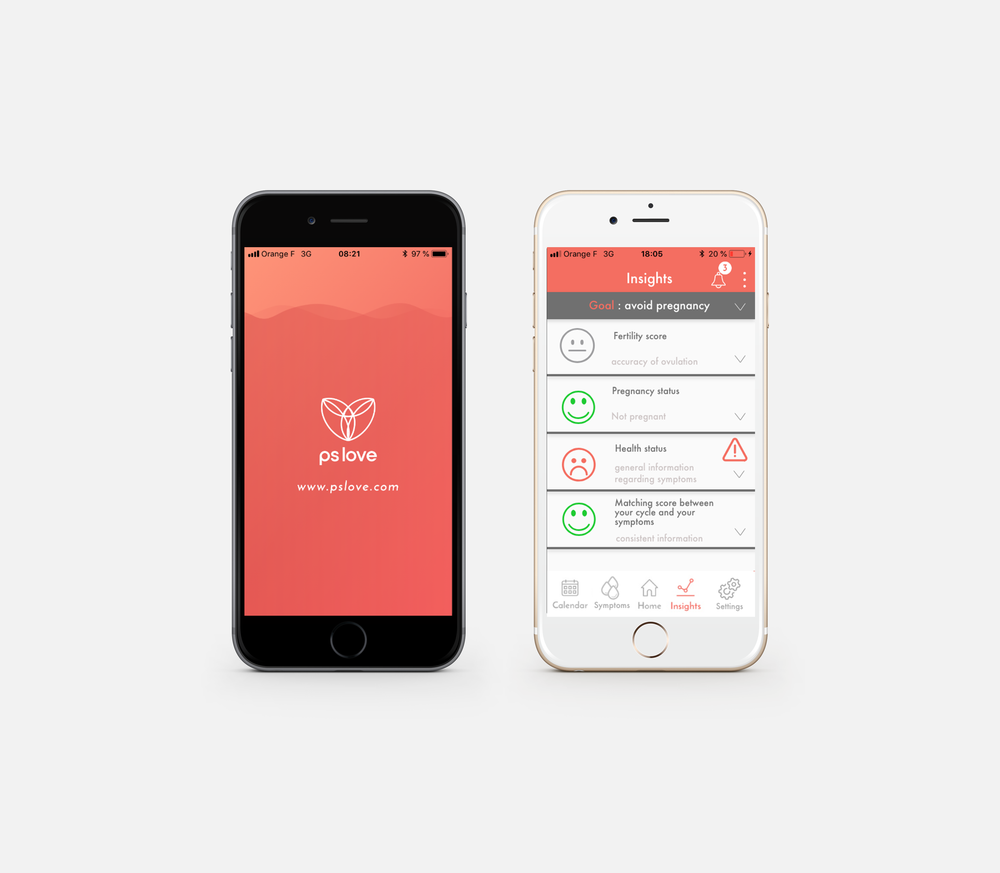
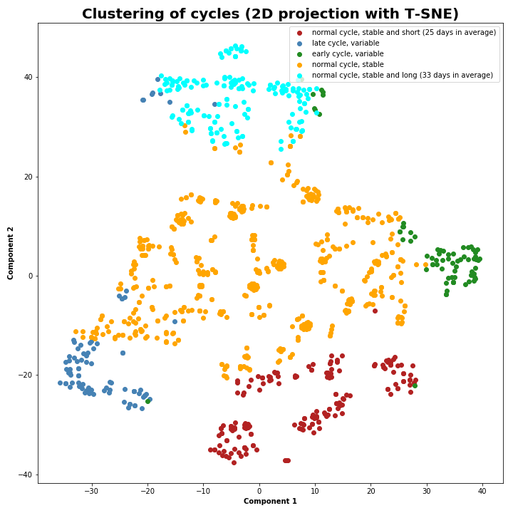
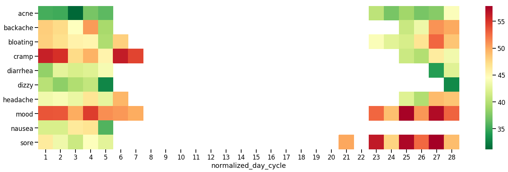
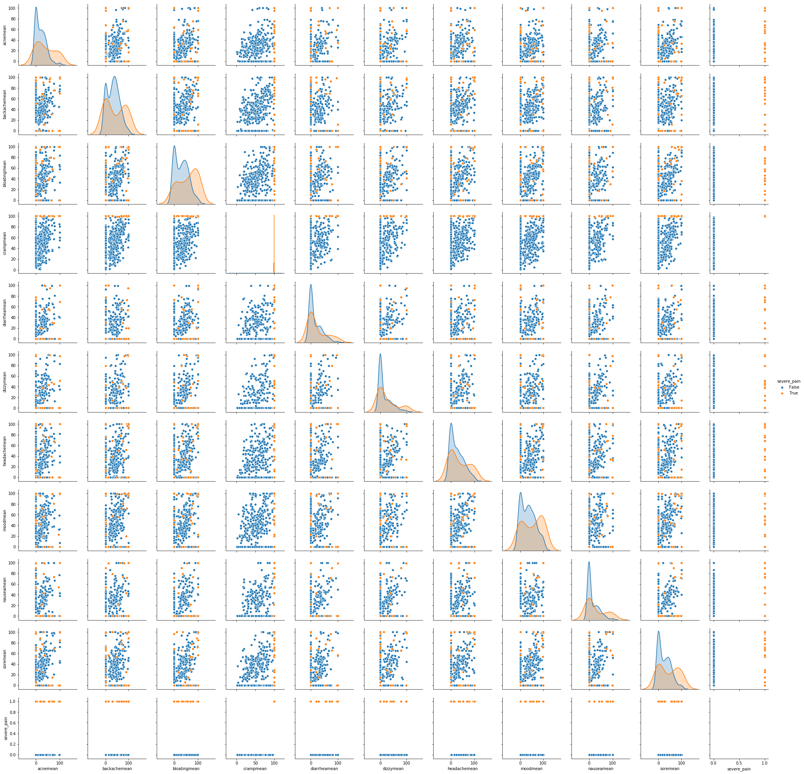

# nostalgic_pare
Project made during the 2019 School of AI Health Hackathon

## Tagline

Enhanced and personalized user experience in PSLove, with additional AI-powered diagnostic hints. 

## Summary Paragraph

We chose to work with the menstruation dataset because it is a phenomenon concerning half of the global population and still a taboo in many families. 

Our project improves the architecture of the application PSLove in order to target more accurately the needs and the profile of the users. New functionalities are offered to enhance the data acquisition in terms of quality and volume. The goal is also to improve and personalize the user experience through a friendly interface and relevant feedbacks. This interface is designed to ease the processing of the data and feed our AI algorithms, allowing insights and personalized recommendations. Because of such improvements, a user could now receive notifications in case of endometriosis suspicion and pregnancy. Plus, an accurate profiling based on their declarations allows a comparison between their cycle and their symptoms. We hope this project could be a step toward a better health and body monitoring and increase communication and knowledge about menstruations. 

## Link to the one page article

LINK : https://github.com/loljambe/nostalgic_pare/blob/master/Nostalgic_pare.pdf

## Link to a demonstration video

LINK : https://drive.google.com/file/d/1ltpSMrpslg6plflZHsNPNK6o_KJkjieQ/view

### Setup instructions
Data should be put in a data folder at the root of the project
python version Python 3.5.1, and other dependancies are listed in the ```requirements.txt``` file.

### Achievements
#### Improved user interface
We have proposed a new enhanced user interface, leveraging the user's goals in data collection for a personalized experience, and have hints to offer personalized advanced insights, like early pregnancy detection, symptoms anomaly, and endometriosis suspicions

{:height="300px" width="200px"}

#### Results on pregnancy detection
We have clustered cycles based on their lengths, and anomalies of length compared to the users' other cycles. A cluster (blue in the plot below) represents cycles that are significantly longer than the user's usual and may be pregnant and should monitor their period closely.



#### Results on symptoms to cycle matching
The objective of this analysis is to correlate the variations of symptoms with the day of the cycle. For all users, cycle length was normalized to a "standard" 28-day cycle, and the mean intensity of symptoms was computed when enough different users (more than 25) logged their symptoms into the app for that day of their cycle.

We observe known patterns of pain and disorders between J1 and J5, and symptoms of pre-menstrual syndroms at the end of the cycle.

 

To obtain the matching of one user's symptoms with respect to "normal" symptoms, one needs to compute the cosine similarity between user's symptoms vector and the average vector for that day of the cycle. A similarity close to 1 indicates that the symptoms matched what is expected at that time of the cycle, otherwise, it means that symptoms may have other causes, and indicate another disorder if symptoms persist.

#### Results on endometriosis suspiscion
The objective of this analysis is to detect if some users have symptoms of endometriosis, that is accute pain during period ("cramp" in the data). We isolate the users with most accurate pain at J1 of the cycle, and observe their other symptoms. Although the sample is small we see that this "severe pain" population (16 patients) exhibits high intensity of other endometriosis symptoms: backpain, bloating, sore, but not for other symptoms, like diarrhea or dizziness. A larger sample is needed to have deeper statistical analyses.

 

The ideal would be to have the endometriosis diagnosis in the data themselves (i.e. the app asks users), so that the diagnosis could maybe be predicted for other similar patients, to improve suspiscion of endometriosis detection
